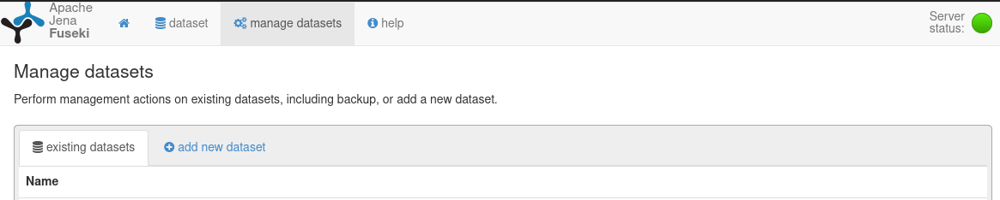
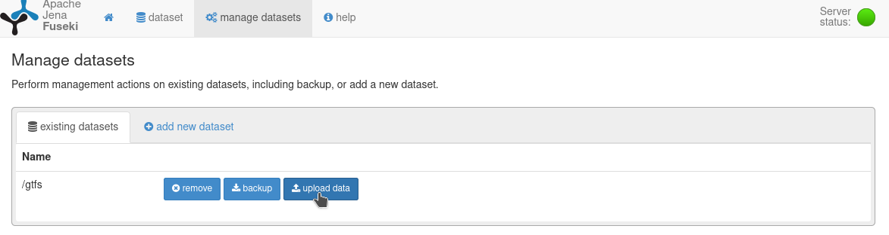

# Web semantic project

# Installation

* Clone this repository and `cd` into it:
```
$ git clone https://github.com/charlyalizadeh/ESILV_WebSemantic
$ cd ESILV_WebSemantic
```
* Create a [virtual environment](https://docs.python.org/3/tutorial/venv.html) and activate it:
```bash
$ python3 -m venv .venv
$ source .venv/bin/activate # On windows: .venv\Scripts\activate.bat
```
* Install the requirements
```bash
$ pip install -r requirements.txt
```

## Fuseki

### With `setup_fuseki.py`

Note that you need to have a activated virtual environment with the packages in `requirements.txt` installed.
Note also that this script setups fuseki with docker.
```bash
$ python setup_fuseki.py
```

You can also setup fuseki manually thanks to the following instructions:


###  Manually

The following instructions explain how to install fuseki with docker. [(Install without docker)](https://jena.apache.org/documentation/fuseki2/#download-fuseki)
1. Pull the docker image:
```bash
$ docker pull stain/jena-fuseki
```
2. Create a docker volume for data persistence:
```bash
$ docker run --name fuseki-data -v /fuseki busybox
```
3. Create the fuseki container (you can change the admin password if you like):
```bash
$ docker run -d --name fuseki -p 3030:3030 --volumes-from fuseki-data -e ADMIN_PASSWORD=pw stain/jena-fuseki
```
4. Enter the container and install `procps` (required to stop and restart the container without errors)
```bash
$ docker exec -it fuseki bash
/jena-fuseki$ apt-get upgrade
/jena-fuseki$ apt-get install -y --no-install-recommends procps
```
Now go on [http://localhost:3030](http://localhost:3030) and you should be able to access the fuseki web interface (user: *admin*, password: *pw*)

### Import the data

1. Unzip `gtfsintriples.zip`
```bash
$ unzip gtfsintriples.zip
```
2. Create the `gtfs` database

3. Upload `gtfsintriples.ttl` to the database (it can take a while):


The fuseki triplestore is now configured to work with the flask application

# Run the app

* Activate your virtual environment
```bash
$ source .venv/bin/activate # On windows: .venv\Scripts\activate.bat
```

* Setup the environment variables
```bash
# Linux and MacOS:
$ export FLASK_APP=flaskr
$ export FLASK_ENV=development

# Windows cmd
> set FLASK_APP=flaskr
> set FLASK_ENV=development

# Windows PowerShell
> $env:FLASK_APP = "flaskr"
> $env:FLASK_ENV = "development"
```

* Run the flask app:
```bash
$ flask run
```

You should be able to access our app on [http://localhost:5000/](http://localhost:5000/)

# Credits

This project relies highly on [linked-gtfs](https://github.com/OpenTransport/linked-gtfs) and [gtfs-csv2rdf](https://github.com/OpenTransport/gtfs-csv2rdf) by [Pieter Colpaert](https://github.com/pietercolpaert).
